## Комп'ютерні системи імітаційного моделювання
## СПм-24-1, **Авраменко Богдан Олегович**
### Лабораторна робота №**1**. Опис імітаційних моделей та проведення обчислювальних експериментів

 

### Варіант 1, модель у середовищі NetLogo:
[Traffic Grid](https://www.netlogoweb.org/launch#http://www.netlogoweb.org/assets/modelslib/Sample%20Models/Social%20Science/Traffic%20Grid.nlogo)

 

### Вербальний опис моделі:
Симуляція руху автомобілів у міській сітці доріг, що складається з перехресть зі світлофорами. Кожен автомобіль моделюється агентом, який дотримується простого набору наступних правил: 
- Автомобілі намагаються рухатися вперед зі своєю поточною швидкістю. 
- Якщо їхня поточна швидкість менша за обмеження швидкості і попереду немає автомобіля безпосередньо перед ними, вони прискорюються.
- Якщо попереду є повільніший автомобіль, вони підлаштовуються під швидкість повільнішого автомобіля та сповільнюються.
- Якщо перед ними є червоне світло або зупинений автомобіль, вони зупиняються.

Існує два способи зміни стану світлофорів:
- **Вручну** — користувач може змінити будь-який світлофор у будь-який момент: спочатку обравши світлофор, а потім натиснувши **CHANGE LIGHT**.
- **Автоматично** — світлофори змінюються один раз за цикл. 
За стандартним налаштуванням світлофори змінюються автоматично на початку кожного циклу.

Модель дозволяє досліджувати, як щільність транспорту, розмір сітки та тривалість циклів світлофорів впливають на пропускну здатність дорожньої мережі.

### Керуючі параметри:
| Параметр | Опис |
|---------|------|
| `grid-size-x` | Кількість вертикальних доріг |
| `grid-size-y` | Кількість горизонтальних доріг |
| `num-cars` | Кількість автомобілів у симуляції |
| `power` | Увімкнення/вимкнення світлофорів |
| `ticks-per-cycle` | Період перемикання світлофорів (у тактах) |
| `speed-limit` | Максимальна швидкість |
| `current-auto?` | Авторежим для поточного світлофора |
| `current-phase` | Відсоток циклу (0–99), на якому перемикається поточний світлофор |

### Внутрішні параметри:
| **Параметр** | **Опис** | **Тип** | **Значення за замовчуванням** | **Коментар** |
|--------------|----------|---------|-------------------------------|--------------|
| `grid-x-inc` | Відстань між вертикальними дорогами (кількість патчів) | глобальна змінна | `world-width / grid-size-x` | Визначає ширину смуги між перехрестями по X |
| `grid-y-inc` | Відстань між горизонтальними дорогами (кількість патчів) | глобальна змінна | `world-height / grid-size-y` | Визначає ширину смуги між перехрестями по Y |
| `acceleration` | Прискорення/гальмування автомобіля за один тік | глобальна змінна | `0.099` | Уникає помилок округлення при `0.1` |
| `phase` | Поточна глобальна фаза циклу світлофорів | глобальна змінна | `0` | Зростає від 0 до `ticks-per-cycle – 1`, потім скидається |
| `num-cars-stopped` | Кількість зупинених автомобілів за поточний тік | глобальна змінна | `0` | Оновлюється в `record-data` |
| `current-light` | Поточний вибраний світлофор (агент-патч) | глобальна змінна | `nobody` (спочатку) | Використовується для ручного керування |
| `intersections` | Множина патчів-перехресть | agentset | — | Формується в `setup-patches` |
| `roads` | Множина патчів-доріг (включаючи перехрестя) | agentset | — | Формується в `setup-patches` |
| `speed` | Швидкість автомобіля (патчів за тік) | змінна turtle | `0` (початково) | Змінюється в `set-car-speed`, `speed-up`, `slow-down` |
| `up-car?` | Напрямок руху: `true` — вниз (вертикально), `false` — вправо (горизонтально) | змінна turtle | випадково або за розташуванням | Встановлюється в `setup-cars` |
| `wait-time` | Час очікування автомобіля (тіків зі швидкістю 0) | змінна turtle | `0` | Нараховується в `record-data` |
| `intersection?` | Чи є патч перехрестям | змінна patch | `false` (спочатку) | `true` лише для перехресть |
| `green-light-up?` | Чи горить зелене світло для вертикального руху | змінна patch | `true` (спочатку) | `true` — вертикаль, `false` — горизонталь |
| `my-row` | Номер рядка перехрестя (згори-зліва) | змінна patch | `-1` (не перехрестя) | Обчислюється в `setup-intersections` |
| `my-column` | Номер стовпця перехрестя (згори-зліва) | змінна patch | `-1` (не перехрестя) | Обчислюється в `setup-intersections` |
| `my-phase` | Фаза перемикання світлофора (0–99) | змінна patch | `0` (спочатку) | Використовується в автоматичному режимі |
| `auto?` | Автоматичний режим світлофора | змінна patch | `true` (спочатку) | `false` — лише ручне керування |
| `current-phase` | Поточна фаза вибраного світлофора (0–99) | глобальна (інтерфейс) | `0` | Керує моментом перемикання |
| `current-auto?` | Авторежим вибраного світлофора | глобальна (інтерфейс) | `on` | Синхронізується з `auto?` |

### Показники роботи системи:
| Показник                     | Опис                                                  |
|------------------------------|-------------------------------------------------------|
| **Stopped Cars**             | Кількість автомобілів, що зупинені (швидкість = 0).   |
| **Average Speed of Cars**    | Середня швидкість усіх автомобілів на поточному такті. |
| **Avarage Wait Time of Cars**| Середній час очікування усіх автомобілів.             |

### Примітки:
- За замовчуванням світлофори працюють у **автоматичному режимі** (`auto? = on`).
- Кожні `ticks-per-cycle` тактів фаза світлофорів змінюється: спочатку зелене світло для вертикального руху, потім — для горизонтального.
- Автомобілі **не повертають**, рухаються лише у своєму початковому напрямку.

### Недоліки моделі:
1. **Відсутність поворотів** — автомобілі рухаються лише прямо, що не відображає реальний міський трафік.
2. **Спрощене гальмування** — автомобілі зупиняються лише безпосередньо перед перешкодою, не враховуючи відстань до наступного автомобіля чи світлофора заздалегідь.
 

### 1. Вплив кількості автомобілів на середню швидкість
Досліджується залежність середньої швидкості всіх автомобілів за 500 тактів від кількості машин у моделі. Експерименти проводилися при значеннях `num-cars` від 25 до 150 з кроком 25. 

 

#### Фіксовані значення моделі
| Параметр | Значення |
|---------|------|
| `grid-size-x` | 3 |
| `grid-size-y` | 3 |
| `power` | true |
| `ticks-per-cycle` | 20 |
| `speed-limit` | 1.0 |

 

#### Результати
<table>
<thead>
<tr><th>Номер ітерації</th><th>Кількість автомобілів</th></tr>
</thead>
<tbody>
<tr><td>1</td><td>25</td></tr>
<tr><td>2</td><td>50</td></tr>
<tr><td>3</td><td>75</td></tr>
<tr><td>4</td><td>100</td></tr>
<tr><td>5</td><td>125</td></tr>
<tr><td>6</td><td>150</td></tr>
</tbody>
</table>

 

| 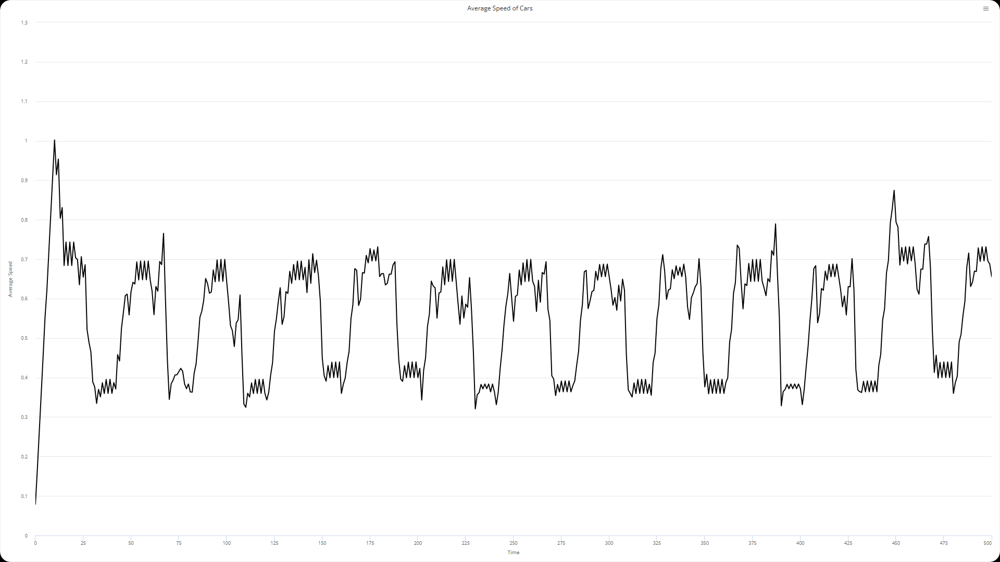 | 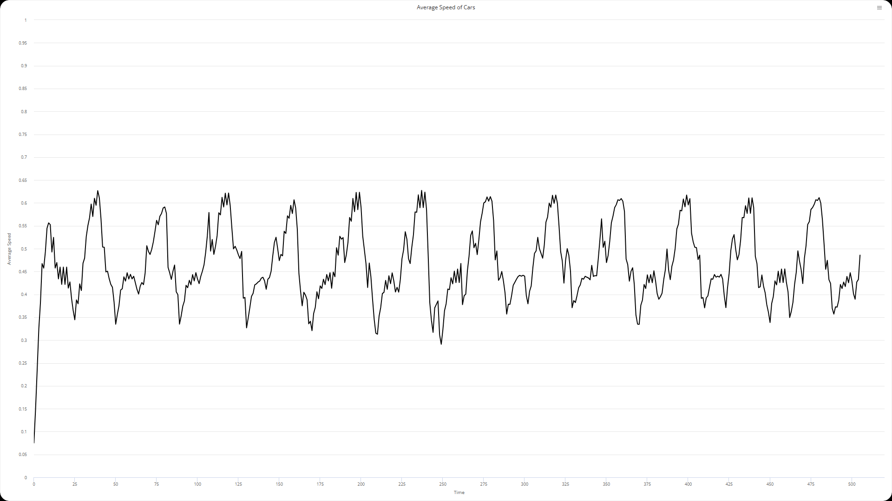 | 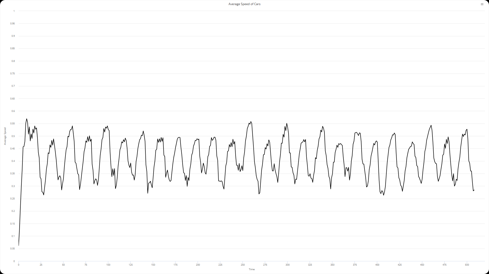 |
|:----------------------------:|:------------------------------:|:------------------------------|
| 25 автомобілів               | 50 автомобілів                 | 75 автомобілів                 |

| 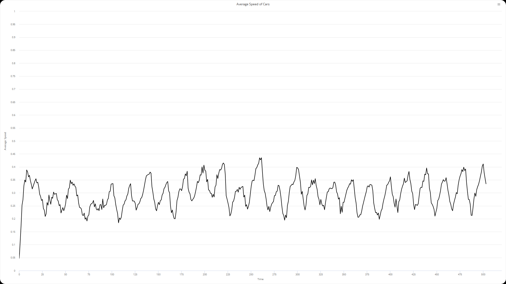 | 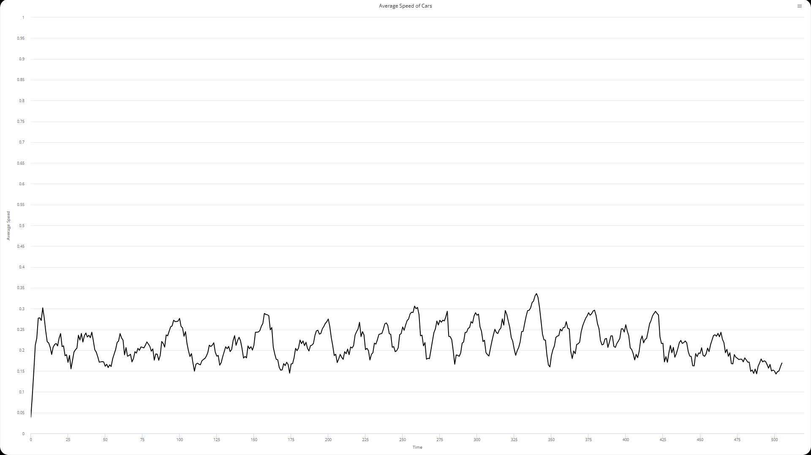 | 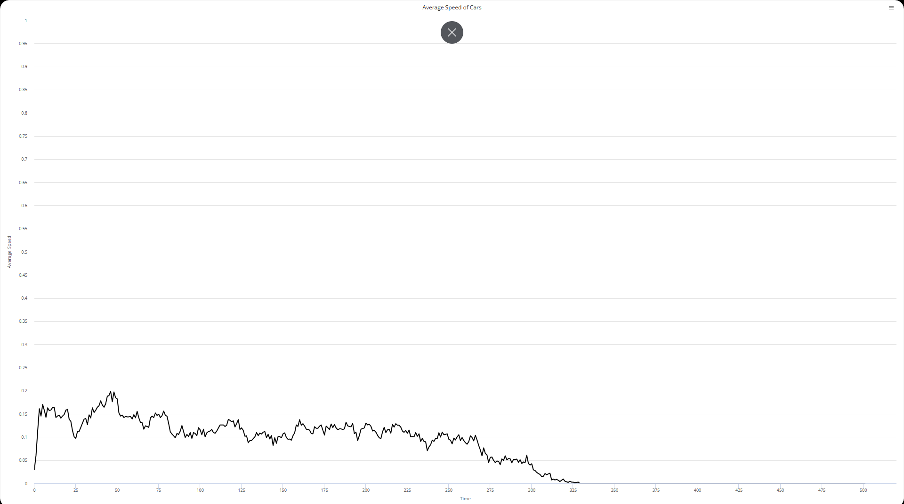 |
|:-------------------------------:|:--------------------------------:|:--------------------------------|
| 100 автомобілів                | 125 автомобілів                  | 150 автомобілів                  |
 

Аналіз отриманих даних свідчить про лінійне зменшення середньої швидкості руху транспортного потоку зі зростанням його щільності (кількості автомобілів). При 150 автомобілях настає повне взаємне блокування руху.

### 2. Вплив періоду перемикання світлофорів на середній час очікування
Досліджується залежність середнього часу очікування всіх автомобілів за 500 тактів від періоду перемикання світлофору. Експерименти проводилися при значеннях `ticks-per-cycle` від 20 до 100 з кроком 20. 

#### Фіксовані значення моделі
| Параметр | Значення |
|---------|------|
| `grid-size-x` | 4 |
| `grid-size-y` | 4 |
| `power` | true |
| `num-cars` | 75 |
| `speed-limit` | 1.0 |

 

#### Результати
<table>
<thead>
<tr><th>Номер ітерації</th><th>Кількість тактів</th></tr>
</thead>
<tbody>
<tr><td>1</td><td>20</td></tr>
<tr><td>2</td><td>40</td></tr>
<tr><td>3</td><td>60</td></tr>
<tr><td>4</td><td>70</td></tr>
<tr><td>5</td><td>80</td></tr>
<tr><td>6</td><td>100</td></tr>
</tbody>
</table>

 

| 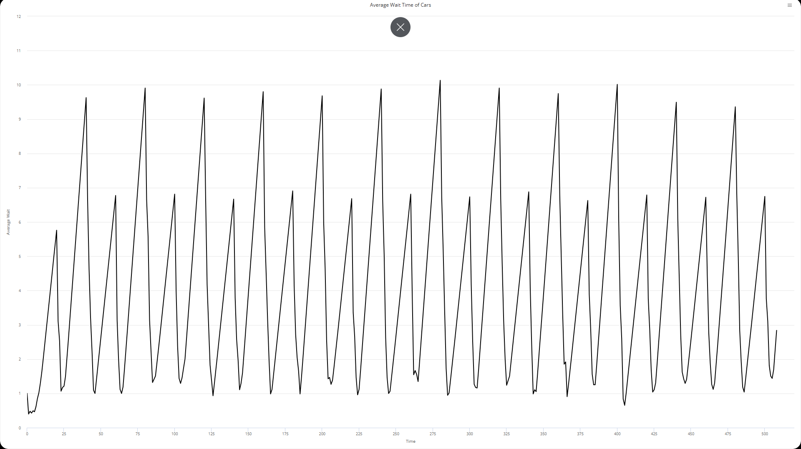   | 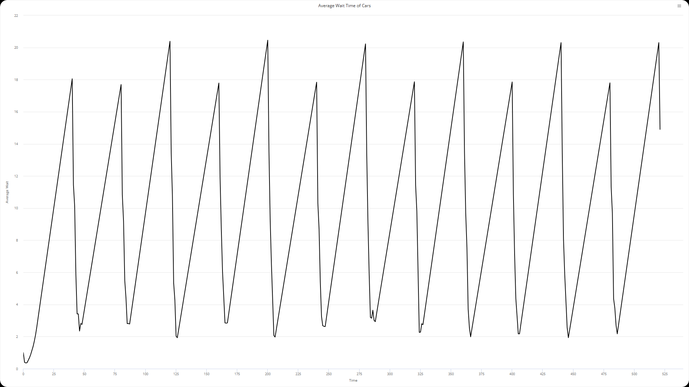   | 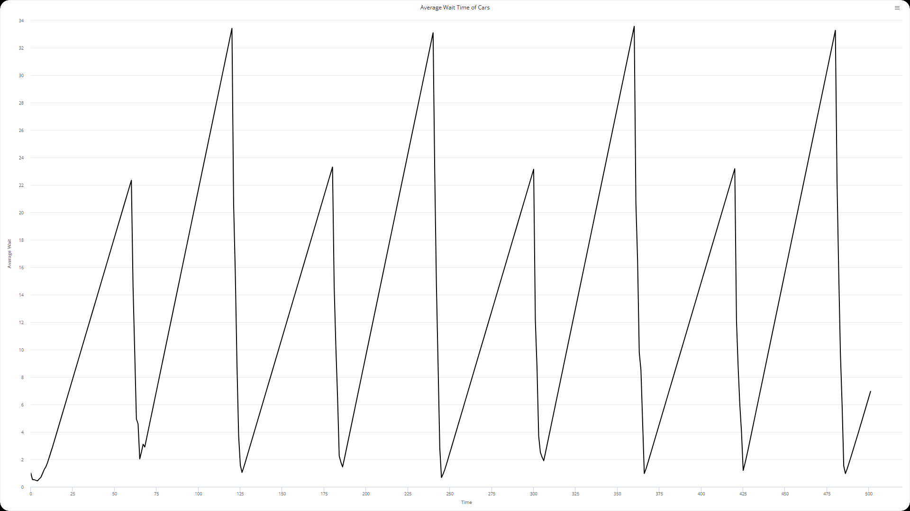   |
|:---------------------------:|:---------------------------:|:---------------------------:|
| 20 тактів                   | 40 тактів                   | 60 тактів                   |

| 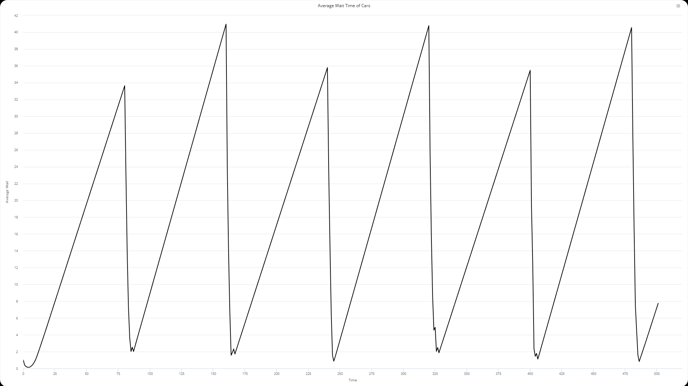   | 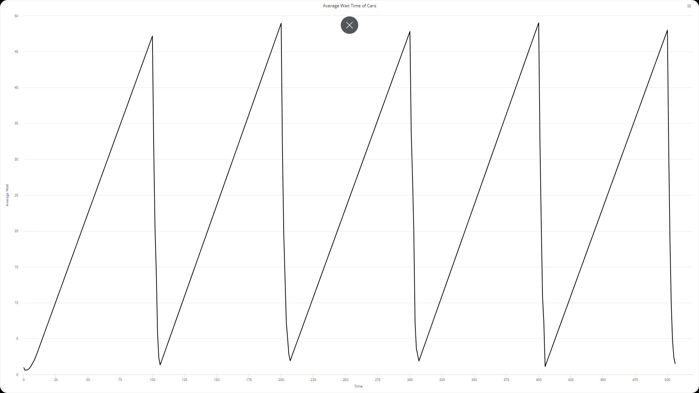  |  |
|:---------------------------:|:----------------------------:|:----------------------------:|
| 70 тактів                   | 80 тактів                    | 100 тактів                   |
 

При збільшенні періоду перемикання світлофорів тривалість кожної окремої зупинки зростає, проте загальна кількість зупинок зменшується, тому що за один цикл зеленого світла автомобіль здатний перетнути кілька регульованих перехресть.

### 3. Вплив обмеження швидкості на кількість зупинених автомобілів
Досліджується залежність числа зупинених автомобілів за 500 тактів від обмеження максимальної швидкості. Експерименти проводилися при значеннях `speed-limit` від 0.2 до 1.0 з кроком 0.2. 

#### Фіксовані значення моделі
| Параметр | Значення |
|---------|------|
| `grid-size-x` | 4 |
| `grid-size-y` | 4 |
| `power` | true |
| `num-cars` | 75 |
| `ticks-per-cycle` | 20 |

#### Результати
<table>
<thead>
<tr><th>Номер ітерації</th><th>Максимальна швидкість</th></tr>
</thead>
<tbody>
<tr><td>1</td><td>0.2</td></tr>
<tr><td>2</td><td>0.4</td></tr>
<tr><td>3</td><td>0.6</td></tr>
<tr><td>4</td><td>0.8</td></tr>
<tr><td>5</td><td>1</td></tr>
</tbody>
</table>

 

| 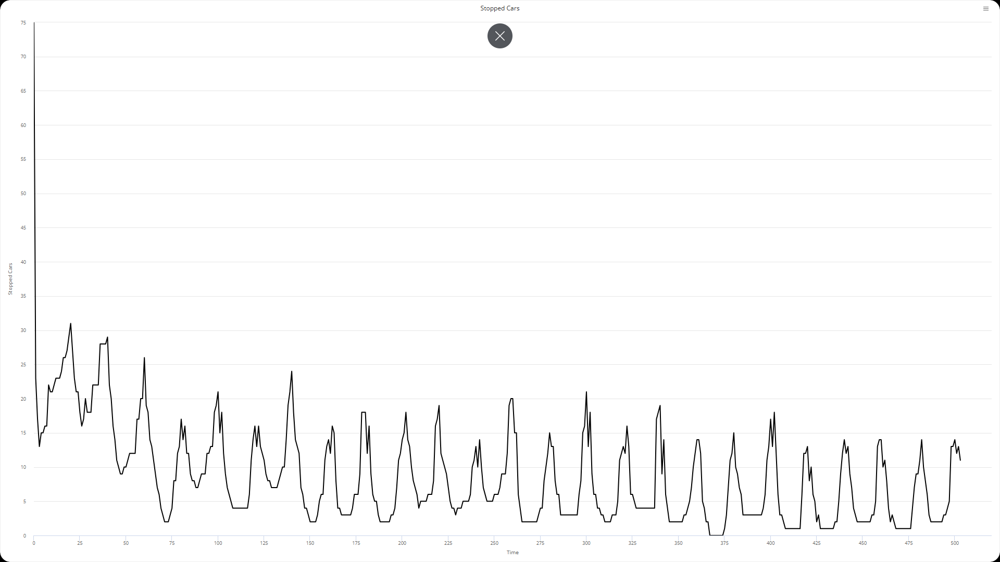     | 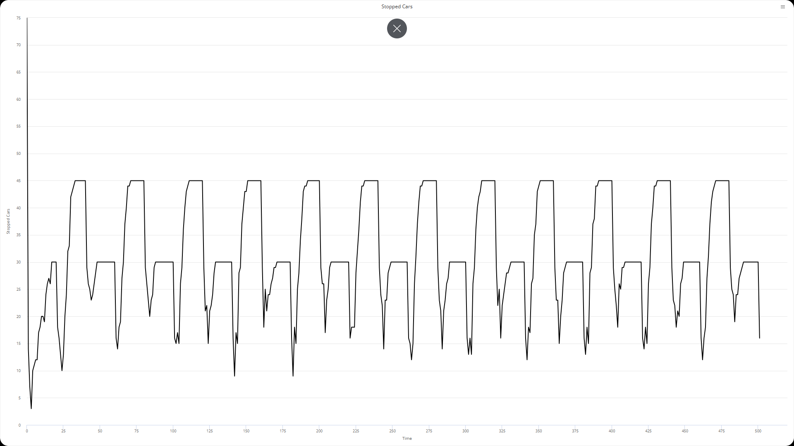     | 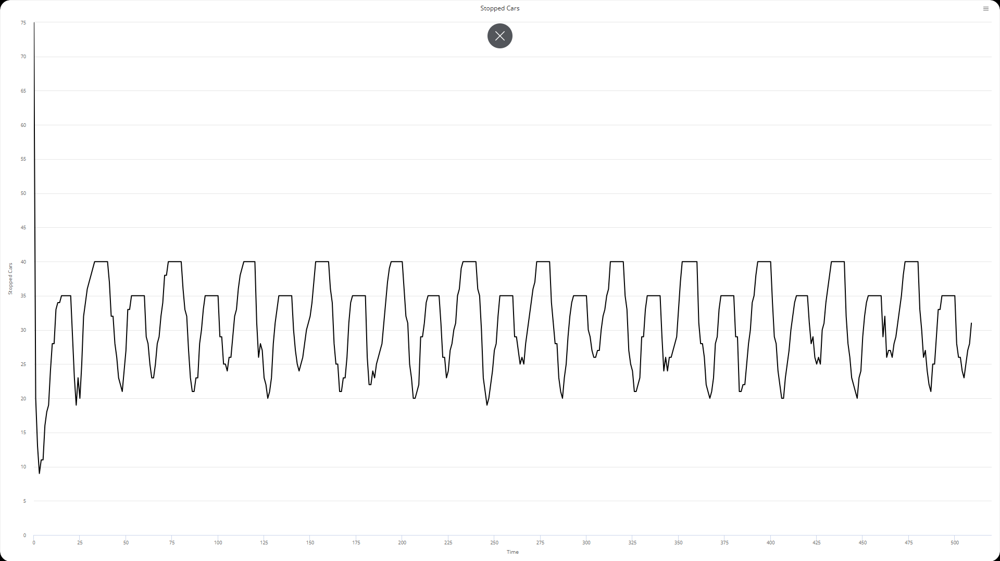     |
|:--------------------------:|:--------------------------:|:--------------------------:|
|  0.2  |  0.4  |  0.6  |

|      | 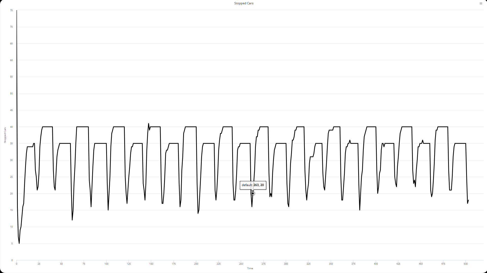     |
|:--------------------------:|:--------------------------:|
|  0.8  |  1.0  |

 

Найменша середня кількість зупинок автомобілів була зафіксована при максимальній швидкості 0,2 (в умовних одиницях). Це пояснюється тим, що за такого темпу руху автомобіль встигав дістатися до наступного перехрещення саме в момент, коли світлофор переходив на зелене світло, і тому міг продовжувати рух без зупинки.

Із збільшенням максимальної дозволеної швидкості середня кількість зупинок зростала. Це відбувалося тому, що автомобіль прибував до наступного світлофора надто швидко — раніше, ніж той встигав перемкнутися на дозвільний (зелений) сигнал.

## Висновки:
Проведені обчислювальні експерименти показали, що параметри моделі Traffic Grid суттєво впливають на ефективність руху транспортного потоку в міській сітці. Зокрема, збільшення кількості автомобілів понад певну критичну межу призводить до різкого падіння середньої швидкості та повного транспортного колапсу. Подовження періоду перемикання світлофорів (ticks-per-cycle) зменшує середній час очікування автомобілів, оскільки дозволяє проїжджати кілька перехресть за один цикл зеленого світла. Зниження максимальної дозволеної швидкості до 0.2–0.4 дає парадоксальний позитивний ефект: автомобілі краще синхронізуються з фазами світлофорів і зупиняються значно рідше, ніж при speed-limit = 1.0.

Загалом модель наочно демонструє нелінійний характер транспортних потоків, існування критичної щільності та можливість суттєвого покращення пропускної здатності мережі за рахунок правильного налаштування параметрів світлофорів і обмеження швидкості.