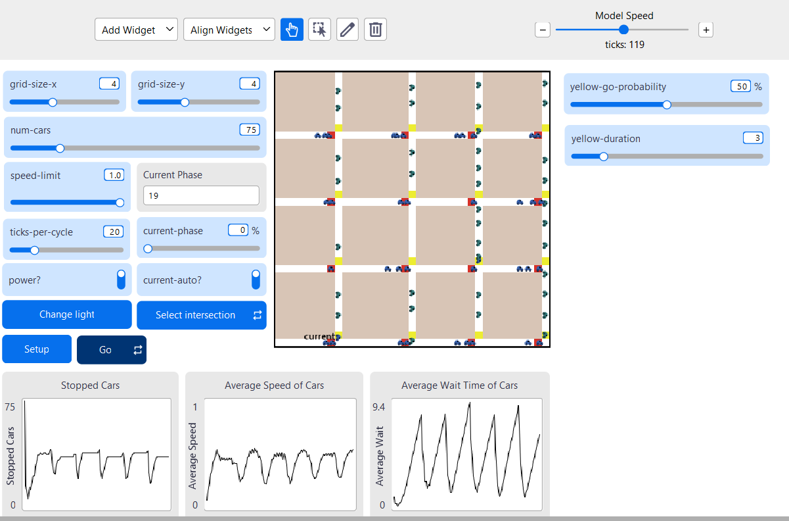
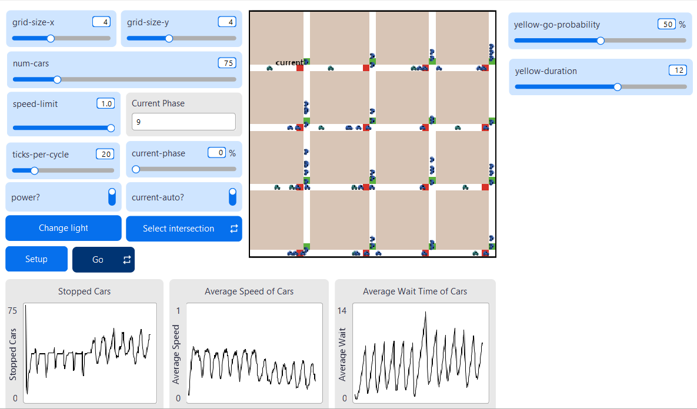
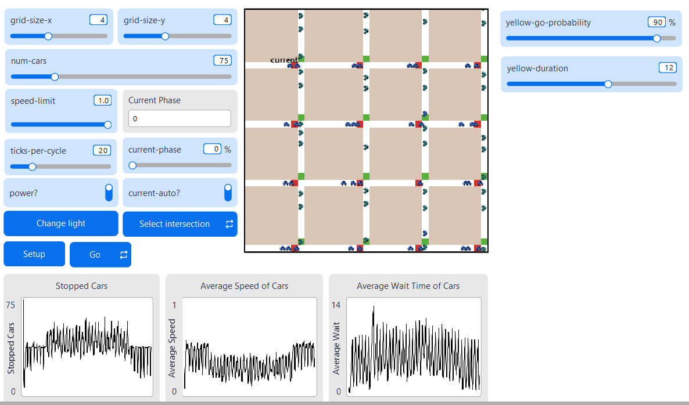
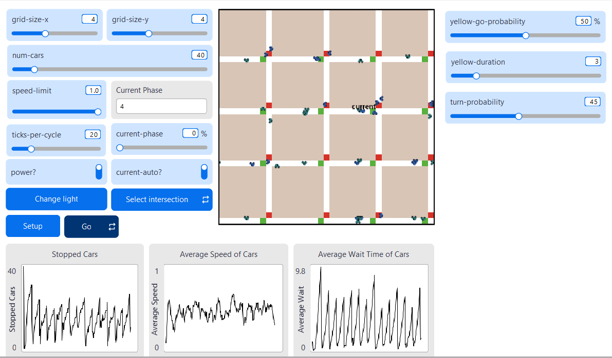

## Комп'ютерні системи імітаційного моделювання
## СПм-24-1, **Авраменко Богдан Олегович**
### Лабораторна робота №**1**. Редагування імітаційних моделей у середовищі NetLogo

 

### Варіант 1, модель у середовищі NetLogo:
[Traffic Grid](https://www.netlogoweb.org/launch#http://www.netlogoweb.org/assets/modelslib/Sample%20Models/Social%20Science/Traffic%20Grid.nlogo)

 

### Внесені зміни у вихідну логіку моделі:
Додати жовтий сигнал світлофорів. Додати вірогідність початку руху водіями не тільки на зелений, але і на жовтий сигнал світлофора.

#### Задамо початкові значенням новим змінним у методі `setup-globals`.
<pre>
  set yellow-duration 3 
  set yellow-go-probability 50
</pre>

#### Додамо нові значення для перехресть `setup-patches`.
<pre>
    set light-state "green-vertical"
    set yellow-countdown 0
</pre>

#### Оновимо логіку методу `set-signals`.
<pre>
  to set-signals
  ask intersections with [auto? and phase = floor ((my-phase * ticks-per-cycle) / 100)]
  [
    ifelse light-state = "green-vertical"
    [
      set light-state "yellow-vertical"
      set yellow-countdown yellow-duration
    ]
    [
      ifelse light-state = "green-horizontal"
      [
        set light-state "yellow-horizontal"
        set yellow-countdown yellow-duration
      ]
      [ ;; якщо вже жовтий - нічого не робимо тут
      ]
    ]
    set-signal-colors
  ]
  

  ask intersections with [yellow-countdown > 0]
  [
    set yellow-countdown yellow-countdown - 1
    
    ;; Коли жовтий закінчився - перемикаємо на червоний і зелений
    if yellow-countdown = 0
    [
      set green-light-up? (not green-light-up?)
      ifelse green-light-up?
      [ set light-state "green-vertical" ]
      [ set light-state "green-horizontal" ]
      set-signal-colors
    ]
  ]
end
</pre>

#### Оновимо логіку методу `set-signal-colors`.
<pre>
to set-signal-colors  ;; intersection (patch) procedure
  ifelse power?
  [
    if light-state = "green-vertical"
    [
      ask patch-at -1 0 [ set pcolor red ]
      ask patch-at 0 1 [ set pcolor green ]
    ]
    
    if light-state = "yellow-vertical"
    [
      ask patch-at -1 0 [ set pcolor red ]
      ask patch-at 0 1 [ set pcolor yellow ]
    ]
    
    if light-state = "green-horizontal"
    [
      ask patch-at -1 0 [ set pcolor green ]
      ask patch-at 0 1 [ set pcolor red ]
    ]
    
    if light-state = "yellow-horizontal"
    [
      ask patch-at -1 0 [ set pcolor yellow ]
      ask patch-at 0 1 [ set pcolor red ]
    ]
  ]
  [
    ask patch-at -1 0 [ set pcolor white ]
    ask patch-at 0 1 [ set pcolor white ]
  ]
end

to set-car-speed  ;; turtle procedure
  ifelse pcolor = red
  [ set speed 0 ]
  [
    ifelse pcolor = yellow
    [
      ifelse random 100 < yellow-go-probability
      [
        ifelse up-car?
        [ set-speed 0 -1 ]
        [ set-speed 1 0 ]
      ]
      [ 
        set speed 0 
      ]
    ]
    [
      ifelse up-car?
      [ set-speed 0 -1 ]
      [ set-speed 1 0 ]
    ]
  ]
end
</pre>

#### Оновимо логіку методу `set-car-speed` для задання нової поведінки автомобілей.

<pre>
to set-car-speed  ;; turtle procedure
  ifelse pcolor = red
  [ set speed 0 ]
  [
    ifelse pcolor = yellow
    [
      ifelse random 100 < yellow-go-probability
      [
        ifelse up-car?
        [ set-speed 0 -1 ]
        [ set-speed 1 0 ]
      ]
      [ 
        set speed 0 
      ]
    ]
    [
      ifelse up-car?
      [ set-speed 0 -1 ]
      [ set-speed 1 0 ]
    ]
  ]
end
</pre>

### Нова функціональність: керування жовтим сигналом світлофора

Тепер у симуляції з’явилися **два нові слайдери** для налаштування поведінки жовтого сигналу:

- `yellow-go-probability` — імовірність, що водій спробує проїхати на жовтий  
- `yellow-duration` — число тактів жовтого сигналу (у секундах)

 

 

#### Вплив параметрів на поведінку водіїв

**1. Збільшення тривалості жовтого сигналу (`yellow-duration`)**  
Призводить до **зростання кількості автомобілів, що зупиняються** перед перехрестям.

 

**2. Збільшення імовірності проїзду на жовтий (`yellow-go-probability`)**  
**Зменшує** число автомобілів, які повністю зупиняються.

 

#### Поворот автомобілів:
На даний момент всі автомобілі рухаються лише по прямій, внесемо зміни, що дозволять їм здійснювати повороти.

#### Додамо нову процедуру `check-turn`, що перевіряє чи автомобіль знаходиться на перехресті і виконує поворот з певною ймовірністю у випадковому напрямку.

<pre>
to check-turn  ;; turtle procedure
  if [intersection?] of patch-here
  [
    if random 100 < turn-probability
    [
      ifelse random 2 = 0
      [
        left 90
      ]
      [
        right 90
      ]
      
      ifelse heading = 180 or heading = 0
      [ set up-car? true ]
      [ set up-car? false ]
    ]
  ]
end
</pre>

Додамо виклик `check-turn` процедури у процедурі `go`
<pre>
  ask turtles [
    set-car-speed
    fd speed
    check-turn
    record-data
    set-car-color
  ]
</pre>

#### Після внесених змін автомобілі виконують повороти на перехрестях, йомвірність виконання повороту задається слайдером `turn-probability`

 

 

## Висновки:
Під час виконання лабораторної роботи було внесено зміни до моделі дорожнього руху у середовищі NetLogo, що дозволили дослідити вплив жовтого сигналу світлофора та поведінки водіїв на інтенсивність руху. Проведені обчислювальні експерименти показали, що збільшення тривалості жовтого сигналу призводить до зростання кількості зупинок автомобілів, тоді як підвищення ймовірності проїзду на жовтий зменшує число зупинок і покращує пропускну здатність перехресть. Додавання функціональності поворотів дозволило реалізувати більш реалістичну поведінку транспортних засобів на перехрестях. Зміни в логіці моделі дозволили краще відобразити взаємозв'язки між параметрами світлофорного регулювання, поведінкою водіїв та ефективністю організації дорожнього руху.
