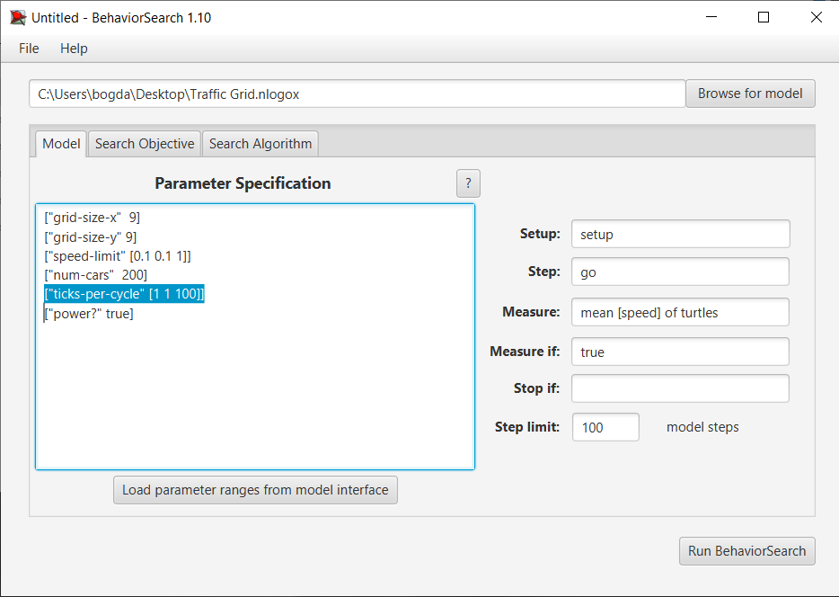
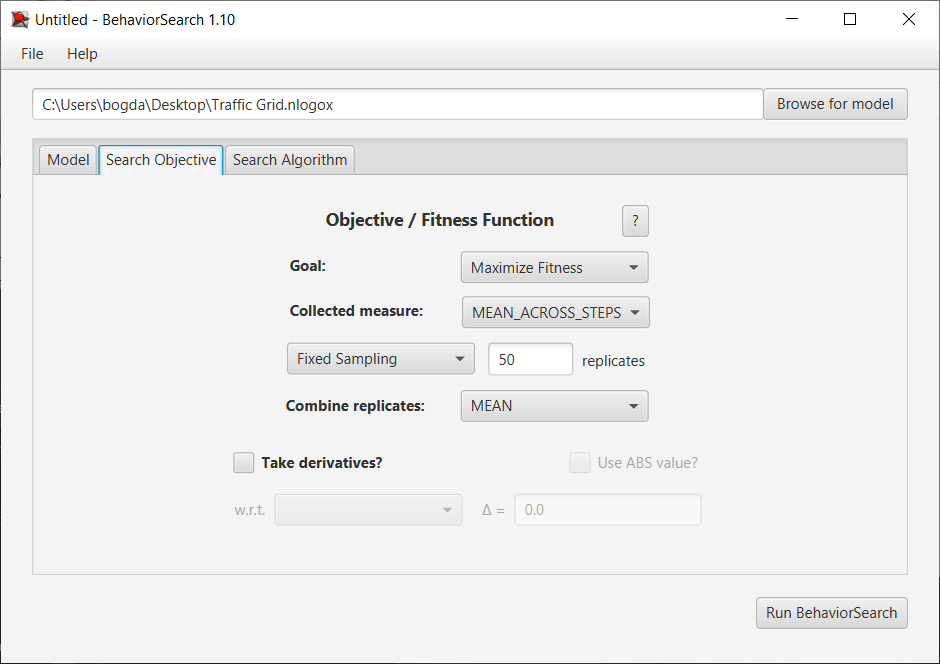
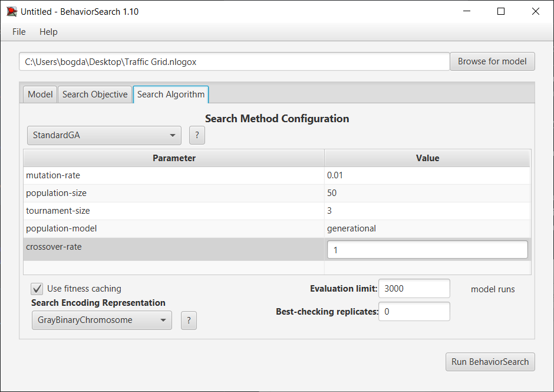
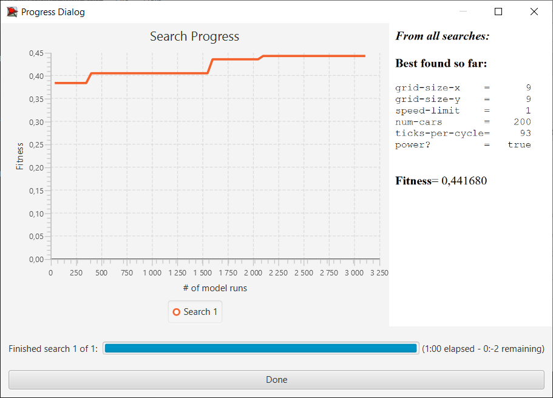
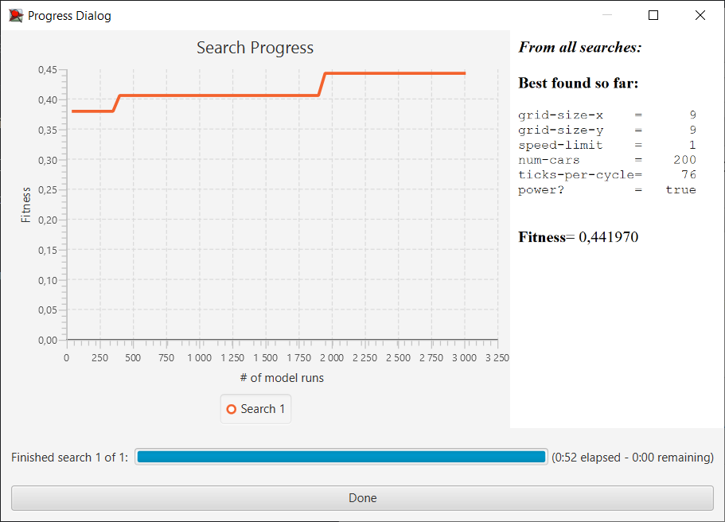
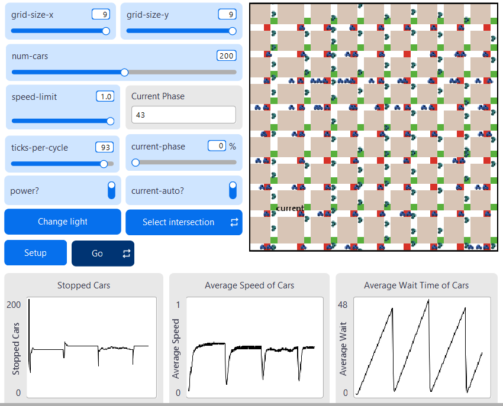
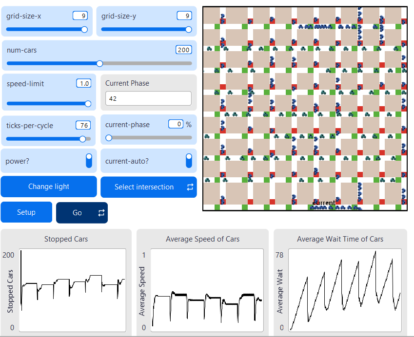

## Комп'ютерні системи імітаційного моделювання
## СПм-24-1, **Авраменко Богдан Олегович**
### Лабораторна робота №**3**. Використання засобів обчислювального інтелекту для оптимізації імітаційних моделей

 

### Варіант 1, модель у середовищі NetLogo:
[Traffic Grid](https://www.netlogoweb.org/launch#http://www.netlogoweb.org/assets/modelslib/Sample%20Models/Social%20Science/Traffic%20Grid.nlogo)

 

### Вербальний опис моделі:
Симуляція руху автомобілів у міській сітці доріг, що складається з перехресть зі світлофорами. Кожен автомобіль моделюється агентом, який дотримується простого набору наступних правил: 
- Автомобілі намагаються рухатися вперед зі своєю поточною швидкістю. 
- Якщо їхня поточна швидкість менша за обмеження швидкості і попереду немає автомобіля безпосередньо перед ними, вони прискорюються.
- Якщо попереду є повільніший автомобіль, вони підлаштовуються під швидкість повільнішого автомобіля та сповільнюються.
- Якщо перед ними є червоне світло або зупинений автомобіль, вони зупиняються.

Існує два способи зміни стану світлофорів:
- **Вручну** — користувач може змінити будь-який світлофор у будь-який момент: спочатку обравши світлофор, а потім натиснувши **CHANGE LIGHT**.
- **Автоматично** — світлофори змінюються один раз за цикл. 
За стандартним налаштуванням світлофори змінюються автоматично на початку кожного циклу.

Модель дозволяє досліджувати, як щільність транспорту, розмір сітки та тривалість циклів світлофорів впливають на пропускну здатність дорожньої мережі.

### Керуючі параметри:
| Параметр | Опис |
|---------|------|
| `grid-size-x` | Кількість вертикальних доріг |
| `grid-size-y` | Кількість горизонтальних доріг |
| `num-cars` | Кількість автомобілів у симуляції |
| `power` | Увімкнення/вимкнення світлофорів |
| `ticks-per-cycle` | Період перемикання світлофорів (у тактах) |
| `speed-limit` | Максимальна швидкість |
| `current-auto?` | Авторежим для поточного світлофора |
| `current-phase` | Відсоток циклу (0–99), на якому перемикається поточний світлофор |

### Внутрішні параметри:
| **Параметр** | **Опис** | **Тип** | **Значення за замовчуванням** | **Коментар** |
|--------------|----------|---------|-------------------------------|--------------|
| `grid-x-inc` | Відстань між вертикальними дорогами (кількість патчів) | глобальна змінна | `world-width / grid-size-x` | Визначає ширину смуги між перехрестями по X |
| `grid-y-inc` | Відстань між горизонтальними дорогами (кількість патчів) | глобальна змінна | `world-height / grid-size-y` | Визначає ширину смуги між перехрестями по Y |
| `acceleration` | Прискорення/гальмування автомобіля за один тік | глобальна змінна | `0.099` | Уникає помилок округлення при `0.1` |
| `phase` | Поточна глобальна фаза циклу світлофорів | глобальна змінна | `0` | Зростає від 0 до `ticks-per-cycle – 1`, потім скидається |
| `num-cars-stopped` | Кількість зупинених автомобілів за поточний тік | глобальна змінна | `0` | Оновлюється в `record-data` |
| `current-light` | Поточний вибраний світлофор (агент-патч) | глобальна змінна | `nobody` (спочатку) | Використовується для ручного керування |
| `intersections` | Множина патчів-перехресть | agentset | — | Формується в `setup-patches` |
| `roads` | Множина патчів-доріг (включаючи перехрестя) | agentset | — | Формується в `setup-patches` |
| `speed` | Швидкість автомобіля (патчів за тік) | змінна turtle | `0` (початково) | Змінюється в `set-car-speed`, `speed-up`, `slow-down` |
| `up-car?` | Напрямок руху: `true` — вниз (вертикально), `false` — вправо (горизонтально) | змінна turtle | випадково або за розташуванням | Встановлюється в `setup-cars` |
| `wait-time` | Час очікування автомобіля (тіків зі швидкістю 0) | змінна turtle | `0` | Нараховується в `record-data` |
| `intersection?` | Чи є патч перехрестям | змінна patch | `false` (спочатку) | `true` лише для перехресть |
| `green-light-up?` | Чи горить зелене світло для вертикального руху | змінна patch | `true` (спочатку) | `true` — вертикаль, `false` — горизонталь |
| `my-row` | Номер рядка перехрестя (згори-зліва) | змінна patch | `-1` (не перехрестя) | Обчислюється в `setup-intersections` |
| `my-column` | Номер стовпця перехрестя (згори-зліва) | змінна patch | `-1` (не перехрестя) | Обчислюється в `setup-intersections` |
| `my-phase` | Фаза перемикання світлофора (0–99) | змінна patch | `0` (спочатку) | Використовується в автоматичному режимі |
| `auto?` | Автоматичний режим світлофора | змінна patch | `true` (спочатку) | `false` — лише ручне керування |
| `current-phase` | Поточна фаза вибраного світлофора (0–99) | глобальна (інтерфейс) | `0` | Керує моментом перемикання |
| `current-auto?` | Авторежим вибраного світлофора | глобальна (інтерфейс) | `on` | Синхронізується з `auto?` |

### Показники роботи системи:
| Показник                     | Опис                                                  |
|------------------------------|-------------------------------------------------------|
| **Stopped Cars**             | Кількість автомобілів, що зупинені (швидкість = 0).   |
| **Average Speed of Cars**    | Середня швидкість усіх автомобілів на поточному такті. |
| **Avarage Wait Time of Cars**| Середній час очікування усіх автомобілів.             |

### Налаштування середовища BehaviorSearch:

**Обрана модель**:
<pre>
C:\Users\bogda\Desktop\Traffic Grid.nlogox
</pre>
**Параметри моделі** (вкладка Model):  
*Параметри та їх модливі діапазони були **автоматично** вилучені середовищем BehaviorSearch із вибраної імітаційної моделі, для цього є кнопка «Завантажити діапазони параметрів із інтерфейсу моделі»*:
<pre>
["grid-size-x" [1 1 9]]
["grid-size-y" [1 1 9]]
["speed-limit" [0.1 0.1 1]]
["num-cars" [1 1 400]]
["ticks-per-cycle" [1 1 100]]
["current-phase" [0 1 99]]
["current-auto?" true false]
["power?" true false]
</pre>

Після модифікації
<pre>
["grid-size-x"  9]
["grid-size-y" 9]
["speed-limit" [0.1 0.1 1]]
["num-cars"  200]
["ticks-per-cycle" [1 1 100]]
["power?" true]
</pre>

Загальний вигляд вкладки налаштувань параметрів моделі:

### Обґрунтування внесених змін:

1. **grid-size-x та grid-size-y** - змінено з діапазону `[1 1 9]` на фіксовані значення `9`:
   - Максимальний розмір сітки 9×9 обрано для забезпечення достатньої кількості дорожніх патчів
   - Сітка 9×9 створює приблизно **140-160 дорожніх патчів**, що дозволяє розмістити велику кількість автомобілів без конфліктів
   - Фіксування розміру усуває проблему невідповідності між кількістю машин і доступними дорогами, яка призводила до помилки `"There are too many cars for the amount of road"`
   - Це дозволяє сконцентруватися на оптимізації динамічних параметрів руху (швидкість та цикли світлофорів), а не геометрії міста

2. **num-cars** - змінено з діапазону `[1 1 400]` на фіксоване значення `200`:
   - Фіксування на максимальному значенні 200 машин створює умови **високого навантаження** на транспортну систему
   - Це дозволяє досліджувати ефективність оптимізації саме в складних умовах інтенсивного трафіку
   - При сітці 9×9 кількість 200 машин є допустимою і не викликає помилок ініціалізації та блокувань
   - Постійна кількість автомобілів робить результати різних запусків порівнянними між собою

3. **speed-limit** - **залишено без змін** `[0.1 0.1 1]`:
   - Діапазон від 0.1 до 1.0 є достатнім для дослідження впливу обмеження швидкості
   - Цей параметр безпосередньо впливає на середню швидкість руху, яка є метрикою оптимізації
   - Крок 0.1 забезпечує 10 різних варіантів швидкісного режиму

4. **ticks-per-cycle** - **залишено без змін** `[1 1 100]`:
   - Тривалість циклу світлофора від 1 до 100 тактів охоплює весь спектр можливих режимів
   - Короткі цикли (1-20 тактів) відповідають агресивному перемиканню
   - Довгі цикли (80-100 тактів) моделюють повільне перемикання з довгими очікуваннями
   - Оптимізація цього параметра є ключовою для балансу між пропускною здатністю та середньою швидкістю
   - 100 можливих значень забезпечують детальний простір пошуку

5. **current-phase** - **видалено**:
   - Це внутрішня змінна стану моделі, що відстежує поточну фазу циклу світлофора

6. **current-auto?** - **видалено**:
   - Цей параметр контролює режим автоматичного/ручного керування конкретним вибраним перехрестям
   - Призначений для інтерактивної роботи користувача з інтерфейсом, а не для масової оптимізації
   - У контексті автоматизованого пошуку всі перехрестя повинні працювати в автоматичному режимі
   - Його варіювання не має сенсу для оцінки загальної ефективності системи

7. **power?** - змінено з `[true false]` на фіксоване `true`:
   - Параметр визначає, чи увімкнені світлофори в системі
   - При `power? = false` всі світлофори відображаються білим кольором і фактично не функціонують
   - Оптимізація роботи світлофорів (через `ticks-per-cycle`) має сенс лише при їх увімкненому стані
   - Фіксування на `true` гарантує, що досліджується саме керована світлофорами транспортна система

### Логіка оптимізації:

**Залишено для оптимізації 2 параметри**:
- **speed-limit**: 10 можливих значень (від 0.1 до 1.0 з кроком 0.1)
- **ticks-per-cycle**: 100 можливих значень (від 1 до 100 з кроком 1)

Використовувана **міра**:  
Для фітнес-функції *(вона ж функція пристосованості або цільова функція)* було обрано **значення середньої швидкості всіх машин на трасі**, вираз для її розрахунку взято з налаштувань графіка аналізованої імітаційної моделі в середовищі NetLogo  
та вказано у параметрі "**Measure**":

<pre>
mean [ speed ] of turtles
</pre>

Середня швидкість всіх машин на трасі повинна враховуватися **в середньому** за весь період симуляції тривалістю, *для приклада*, 500 тактів (адже на кожному такті є своє значення поточної середньої швидкості усіх учасників дорожного руху), починаючи з 0 такту симуляції.  
*Параметр "**Mesure if**" зі значення true, по суті, і означає, що враховуватимуться всі такти симуляції, а чи не частина їх. Іноді має сенс не враховувати деякі такти через хаос в деяких моделях на початку їх використання. Наприклад, це показано в прикладі з документації BehaviorSearch.  
Параметри "**Setup**" та "**Go**" вказують відповідні процедури ініціалізації та запуску в логіці моделі (зазвичай вони так і називаються). BehaviorSearch в процесі роботи, по суті, замість користувача запускає ці процедури.*  
Параметр зупинки за умовою ("**Stop if**") у разі не використовувався.  
Загальний вигляд вкладки налаштувань параметрів моделі:  

**Налаштування цільової функції** (вкладка Search Objective):  
Метою підбору параметрів імітаційної моделі, що описує дорожній рух двосмуговим шосе, є **максимізація** значення середньої швидкості машин на трасі – це вказано через параметр "**Goal**" зі значенням **Maximize Fitness**. Тобто необхідно визначити такі параметри налаштувань моделі, у яких машини рухаються з максимальною швидкістю. При цьому цікавить не просто середня швидкість всіх машин у якийсь окремий момент симуляції, а середнє її значення за всю симуляцію (тривалість якої (500 кроків) вказувалася на минулій вкладці). Для цього у параметрі "**Collected measure**", що визначає спосіб обліку значень обраного показника, вказано **MEAN_ACROSS_STEPS**.  
Щоб уникнути викривлення результатів через випадкові значення, що використовуються в логіці самої імітаційної моделі, **кожна симуляція повторюється по 50 разів**, результуюче значення розраховується як **середнє арифметичне**.

Загальний вигляд вкладки налаштувань цільової функції:

**Налаштування алгоритму пошуку** (вкладка Search Algorithm):  
*На цьому етапі було визначено модель, налаштовано її параметри (тобто вказано, які з них незмінні, а які в процесі пошуку можуть змінюватися і в яких діапазонах), і обрано міру, що лежить в основі функції пристосованості, що дозволяє оцінити якість кожного перевіряємого BehaviorSearch варіантів рішення.  
У ході дослідження на лабораторній роботі використовуються два алгоритми: Випадковий пошук(**RandomSearch**) і Простий генетичний алгоритм (**StandardGA**).  

Загальний вид вкладки налаштувань алгоритму пошуку:

### Результати використання BehaviorSearch:

Пошук параметрів імітаційної моделі, використовуючи генетичний алгоритм:

 

Результат пошуку параметрів імітаційної моделі, використовуючи випадковий пошук:

Аналіз результатів оптимізації показує, що випадковий пошук та генетичний алгоритм досягли практично ідентичних значень цільової функції (середньої швидкості автомобілів), проте знайшли різні комбінації параметрів. Зокрема, алгоритми віддали перевагу відмінним значенням параметра `ticks-per-cycle` (тривалості циклу світлофора), що свідчить про існування множини оптимальних рішень у просторі пошуку.

### Перевірка коректності отриманих результатів у NetLogo:

## Перевірка результатів у NetLogo

Для підтвердження коректності та практичної застосовності знайдених рішень було проведено верифікацію результатів оптимізації безпосередньо в середовищі NetLogo.
Параметри були введені вручну у модель NetLogo, тестування показало, що обидва алгоритми змогли досягти передбачуваного рівня ефективності.

Результат перевірки коректності Standard GA:

 

Результат перевірки коректності Random Search:

У ході виконання лабораторної роботи було успішно застосовано методи обчислювального інтелекту для оптимізації параметрів імітаційної моделі Traffic Grid. Використання середовища BehaviorSearch дозволило автоматизувати процес підбору оптимальних значень параметрів `speed-limit` та `ticks-per-cycle` для максимізації середньої швидкості руху автомобілів в умовах високого навантаження транспортної мережі (200 автомобілів на сітці 9×9). Обидва досліджувані алгоритми — випадковий пошук та генетичний алгоритм — продемонстрували здатність знаходити ефективні рішення, досягаючи практично ідентичних значень цільової функції, хоча й через різні комбінації параметрів.

## Висновки

У ході виконання лабораторної роботи було успішно застосовано методи обчислювального інтелекту для оптимізації параметрів імітаційної моделі Traffic Grid. Використання середовища BehaviorSearch дозволило автоматизувати процес підбору оптимальних значень параметрів `speed-limit` та `ticks-per-cycle` для максимізації середньої швидкості руху автомобілів в умовах високого навантаження транспортної мережі (200 автомобілів на сітці 9×9). Обидва досліджувані алгоритми — випадковий пошук та генетичний алгоритм — продемонстрували здатність знаходити ефективні рішення, досягаючи практично ідентичних значень цільової функції, хоча й через різні комбінації параметрів.

Експериментальна перевірка знайдених параметрів безпосередньо в NetLogo підтвердила коректність результатів оптимізації та валідність налаштування процесу пошуку. Виявлення множини оптимальних рішень свідчить про складну структуру простору пошуку та наявність компенсаторних ефектів між параметрами системи. 